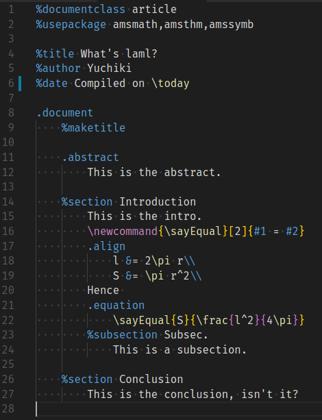
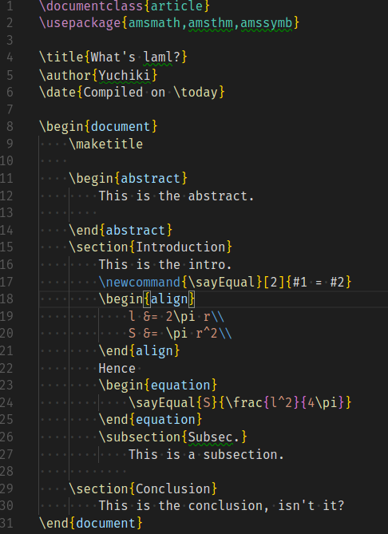

# Laml Converter

## What's this?
A converter from **laml** source to LaTeX source.

For example, the following is a laml source.



The laml file above is converted into the following LaTex file.



This auto-generated LaTeX file can be compiled into a pdf file in usual ways.


## What's laml? 
Haml-like notation of LaTeX source.

## How to use?
`laml < input.laml > output.tex`

## How to install?
```sh
git clone git@github.com:yuchiki/laml.git
cd laml
make install
```

## How does laml look like?
`sample/sample.laml` is an example of laml source file.

## How does the converter work?
`make TEST` generates a LaTeX code and a pdf file from `sample/sample.laml`.
Check what haml-converter generates.