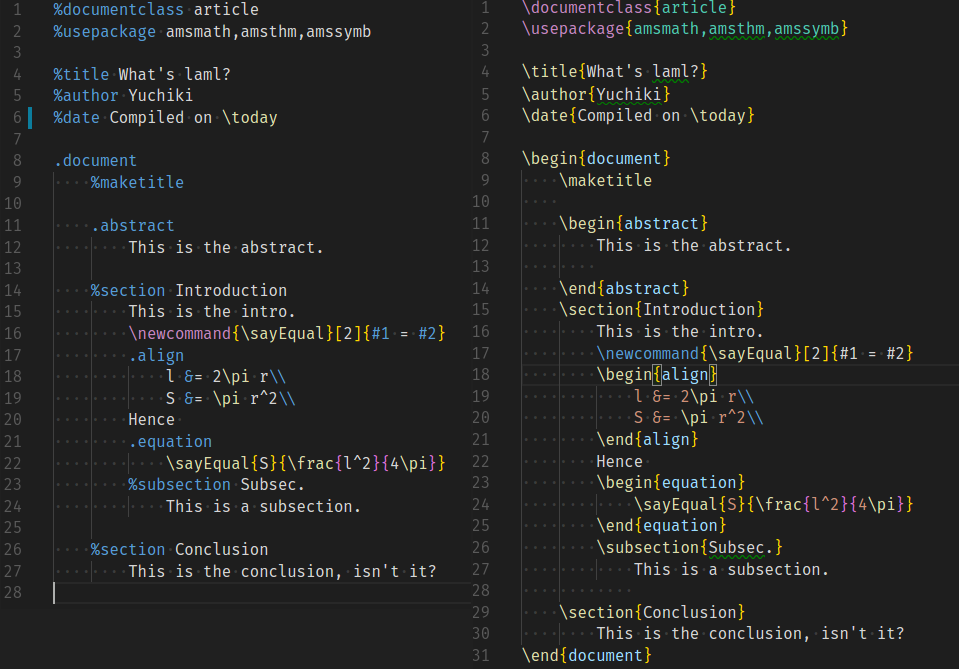
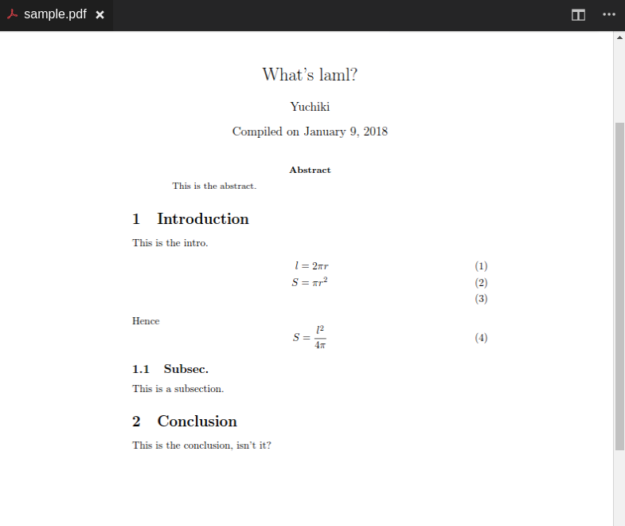

# Laml Converter
Convert a laml source into a LaTeX source.

## What's this?
A converter from **laml** source to LaTeX source.
For example, the left laml file is converted into the right LaTeX file.



This auto-generated LaTeX file can be compiled into a pdf file in usual ways.


## What's laml? 
Haml-like notation of LaTeX source.

A [laml syntax highlighter for VSCode](https://github.com/yuchiki/laml-highlighter) is available.

## How to use?
`laml < input.laml > output.tex` generates output.tex.

And `laml-compile input.laml` generates `input.pdf`.
To change the compilation chain of LaTeX, modify laml-compiler.sh and do `make install` again.

## How to install?
```sh
git clone git@github.com:yuchiki/laml.git
cd laml
make install
```

## How does laml look like?
`sample/sample.laml` is an example of laml source file.

## How does the converter work?
`make TEST` generates a LaTeX code and a pdf file from `sample/sample.laml`.
Check what haml-converter generates.